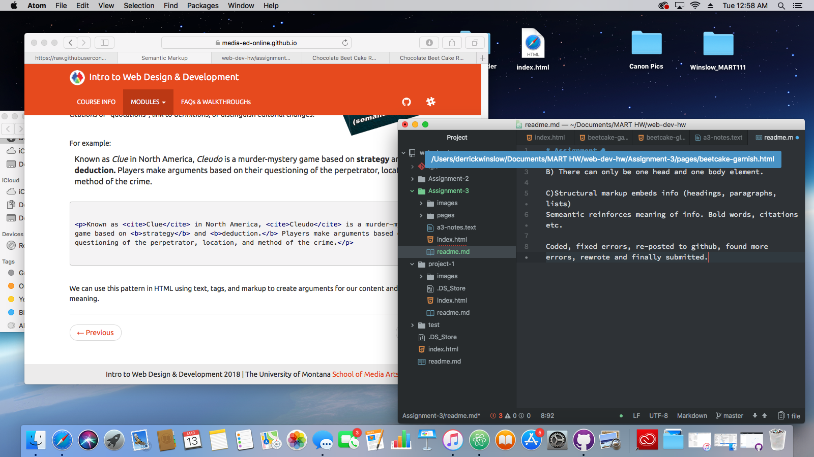

# Assignment 3

B) There can only be one head and one body element.

C)Structural markup embeds info (headings, paragraphs, lists)
Semeantic reinforces meaning of info. Bold words, citations etc.

Coded, fixed errors, re-posted to github, found more errors, rewrote and finally submitted.

