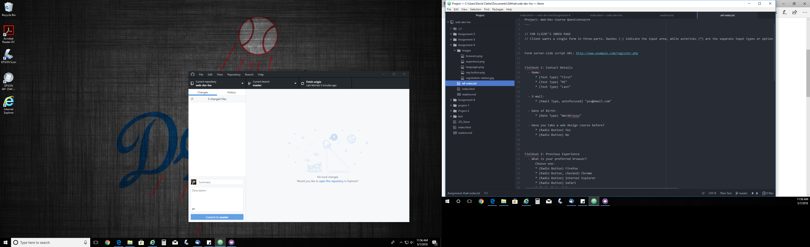

<h1>Assignment 4</h1>
  <h2>Technical Report</h2>

<b>Q: What is alt text and why do we use it?</b>

A: Alternative text, also known as "Alt text" is used to label or add a description to an image. When hovering mouse over image, alt text usually appears.

<b>Q: What types of forms have you come across on the web and what
purpose did they serve?</b>

A: I constantly use forms, whether purchasing packages off Amazon or submitting assignments to Moodle on the University of Montana webiste, forms are being used. Either dropdowns, or selecting radials etc.

This project was difficult for me, I think if I would have gotten it completed before Project 2 that it would have really helped me out. Had to use google search and the course website many many times to complete this code. 

