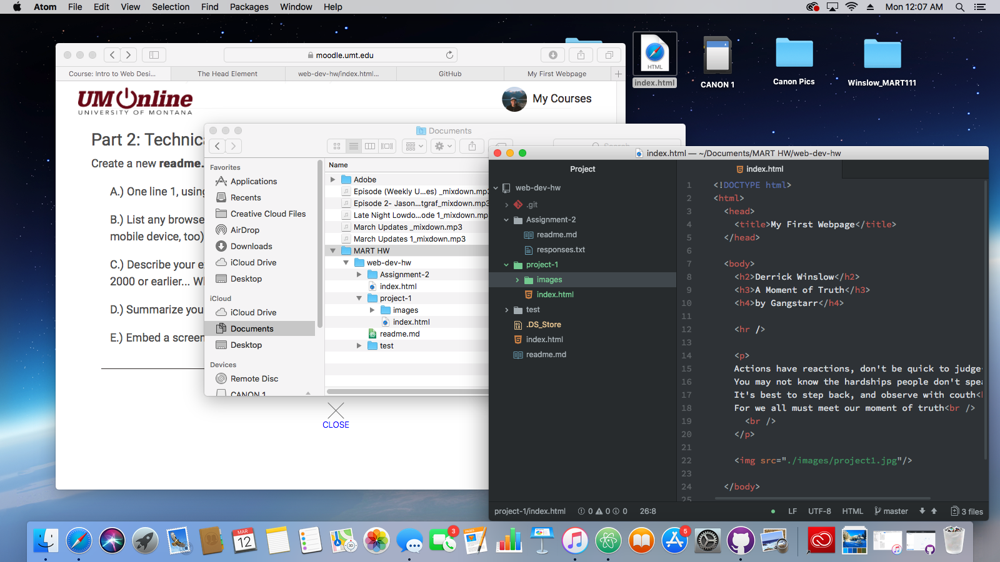

# Project-1 Technical Report

I mainly use Safari since my mobile and home computer devices are Apple products.

I used the Wayback Machine to visit livethemagic.com which was a website for Harry Potter fans. You could enter codes from Minutemaid products to play different flash games. In 2001 the site had many games and advertisements. From 2002-2011 the site did not change much and had a link to buy DVDs. However, in 2014 the site had an update. Since then the site has remained unchanged.

